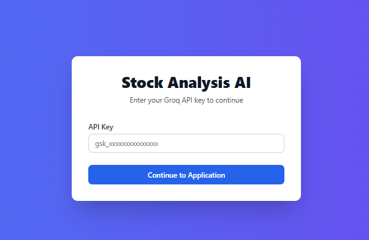

# Pydantic Stock Analysis Pro 📈

A professional Flask web application that combines the power of Groq AI models with Pydantic data validation to provide real-time stock analysis and investment insights.

## Table of Contents
- [Overview](#overview)
- [Features](#features)
- [Screenshots](#screenshots)
- [Technology Stack](#technology-stack)
- [Prerequisites](#prerequisites)
- [Installation](#installation)
- [Environment Setup](#environment-setup)
- [Usage](#usage)
- [API Endpoints](#api-endpoints)
- [Project Structure](#project-structure)
- [Data Models](#data-models)
- [Contributing](#contributing)
- [License](#license)

## Overview

Pydantic Stock Analysis Pro is a sophisticated web application that leverages AI models to provide comprehensive stock analysis. The application offers real-time stock data, investment advice, and technical analysis through an intuitive user interface.

## Features

- 🔒 Secure API key authentication
- 🎨 Elegant UI with dark/light mode support
- 📊 Real-time stock price analysis
- 💡 AI-powered investment recommendations
- 📈 Technical analysis with support/resistance levels
- 🔄 Asynchronous data processing
- 📱 Responsive design for all devices
- 🤖 Integration with multiple Groq AI models
- 🔍 Smart stock symbol extraction
- 📉 Trading volume analysis

## Screenshots

### Authentication Page


### Light Mode


### Dark Mode


## Technology Stack

- **Backend Framework**: Flask
- **AI Integration**: Groq AI Models
- **Data Validation**: Pydantic
- **Stock Data**: yfinance
- **Frontend**: 
  - Tailwind CSS
  - Font Awesome Icons
  - Custom CSS animations
- **Async Support**: nest_asyncio

## Prerequisites

- Python 3.8+
- Groq API Key
- Internet connection for real-time stock data

## Installation

```bash
# Clone the repository
git clone https://github.com/yourusername/Pydantic_Stock_Analysis_Pro.git

# Navigate to project directory
cd Pydantic_Stock_Analysis_Pro

# Create virtual environment
python -m venv venv

# Activate virtual environment
# For Windows
.\venv\Scripts\activate
# For Unix/MacOS
source venv/bin/activate

# Install dependencies
pip install -r requirements.txt
```

## Environment Setup

Create a `.env` file in the root directory:

```env
GROQ_API_KEY=your_groq_api_key_here
FLASK_SECRET_KEY=your_secret_key_here
```

## Usage

1. Start the Flask application:
```bash
python app.py
```

2. Navigate to `http://localhost:5000` in your browser
3. Enter your Groq API key when prompted
4. Start analyzing stocks!

## API Endpoints

- **POST /analyze**
  - Analyzes stock data and provides insights
  - Requires: stock query and model selection
  - Returns: price data, investment advice, technical analysis

- **GET /login**
  - Handles API key authentication
  - Supports both GET and POST methods

## Project Structure

```
Pydantic_Stock_Analysis_Pro/
│
├── app.py                 # Main Flask application
├── static/
│   └── styles.css        # Custom CSS styles
├── templates/
│   ├── index.html        # Main application template
│   └── login.html        # Authentication template
├── requirements.txt      # Project dependencies
└── README.md            # Documentation
```

## Data Models

### StockPriceResult
```python
class StockPriceResult(BaseModel):
    symbol: str
    price: float
    currency: str = "USD"
    message: str
```

### StockAdviceResult
```python
class StockAdviceResult(BaseModel):
    analysis: str
    recommendation: str
    confidence: int
    risk_level: str
```

### TechnicalAnalysisResult
```python
class TechnicalAnalysisResult(BaseModel):
    technical_indicators: dict
    future_outlook: str
    support_levels: list
    resistance_levels: list
    trading_volume: float
```

## Contributing

1. Fork the repository
2. Create your feature branch: `git checkout -b feature/new-feature`
3. Commit your changes: `git commit -m 'Add new feature'`
4. Push to the branch: `git push origin feature/new-feature`
5. Open a Pull Request

## License

This project is licensed under the MIT License - see the [LICENSE](LICENSE) file for details.

---

Created by [Pejman Ebrahimi](https://github.com/arad1367) 

[Visit my Website](https://arad1367.github.io/pejman-ebrahimi/) | [HuggingFace Profile](https://huggingface.co/)